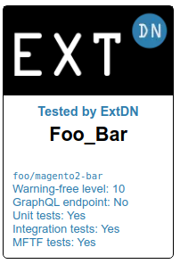

# ExtDN Badge Repository
Repository for generating ExtDN extension badges for ExtDN badges.

**Status: Beta (use at your own risk and do let us know if you are using this)**

## Usage
Add the following to your HTML header:
```html
<link rel="stylesheet" type="text/css" href="https://raw.githubusercontent.com/extdn/extdn-badge-repository/master/css/style.css">
<script src="https://raw.githubusercontent.com/extdn/extdn-badge-repository/master/js/badge.js"></script>
```

Add the following snippet to your own webpage, replacing `Foo_Bar` with the information that you want to show the badge for:
```html
<div id="my-extdn-badge"></div>
<script>getExtDNBadge('Foo_Bar', function(badge) { document.getElementById('my-extdn-badge').innerHTML = badge; });</script>
```

Please note that the extension `Foo_Bar` needs to exist in the `extensions/` folder of this repository. The end-result might appear a bit like the following:



The actual badge is generated via JS, which includes a logo (loaded in either WebP or PNG using a `picture` element) and dynamic information with extension details.

## Magento 2 checks
The following checks are made on a Magento 2 extension:

#### Composer support
An extension needs to include a `composer.json` file. There is no check for this, because it is a bare minimum, not a base for a badge.

#### Magento Coding Standard
An extension needs to comply to the Magento Coding Standard. There is a check that runs all PHP CodeSniffer rules. Next, a number `warnings_at_level` is reported. If for instance, this number is 10, this means that this extension would not be accepted on the Magento Marketplace. A number like 7 to 9 is usually fine. There are little extensions with a `warnings_at_level` lower than 3.

#### GraphQL endpoints
An extension is able to offer GraphQL endpoints. The following checks are in place for this:

- See whether a file `etc/schema.graphqls` exists.

#### Unit tests
An extension is able to offer unit tests. The following checks are in place for this:

- See whether a folder `Test/Unit` exists.

#### Integration tests
An extension is able to offer integration tests. The following checks are in place for this:

- See whether a folder `Test/Integration` exists.

#### MFTF tests
An extension is able to offer MFTF tests. The following checks are in place for this:

- See whether a folder `Test/Mftf` exists.

## Development
This repository ships with various tools to generate badgets. First of all, the `extensions/` folder holds JSON files, each file representing a badge for a specific extension. To generate a new JSON file, clone this repository and run `composer install`. Next, you can use the CLI tool `scripts/extdn_badge_information_generator.php` to point it to an extension folder:

    php scripts/extdn_badge_information_generator.php /my/extension/folder

The output will show JSON which can then be added to a new file in the `extensions/` folder.

Do not forget to add a `information_url` and a `repository_url` in your JSON file. THe `repository_url` information is mandatory for all non-ExtDN members.

## Todo
- Enhance styling of badge on webpage
- Add minified CSS and JavaScript (and generate via Gulp script)
- Integrate PHPStan with the following command:
    - `vendor/bin/phpstan analyse --level 8 --autoload-file=$MAGENTO/vendor/autoload.php -c phpstan.neon $MODULE_SOURCE` 

## Frequently Asked Questions
### Can I just submit my own extension?
As of yet, we do not intend to use this repository for any extension, but we limit this to only those
extensions offered by ExtDN members. The reason for this is that ExtDN is able to trust ExtDN members for
submitting correct extension information.

However, you are welcome to submit your extension. But please note that we will require valid URLs in the JSON
entry (see below).

### How do I submit new extension entries?
Fork this repo under your own GitHub account, check it out locally, copy the example file in the `extensions/` folder and modify it as needed. Next, commit it to your fork and create a Pull Request towards this extension. In short, just send in your PR. 

Do not forget to add a `information_url` and a `repository_url` in your JSON file. THe `repository_url` information is mandatory for all non-ExtDN members.

